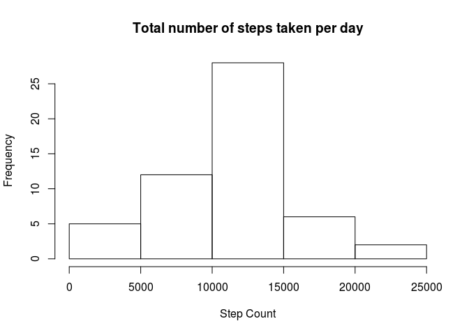
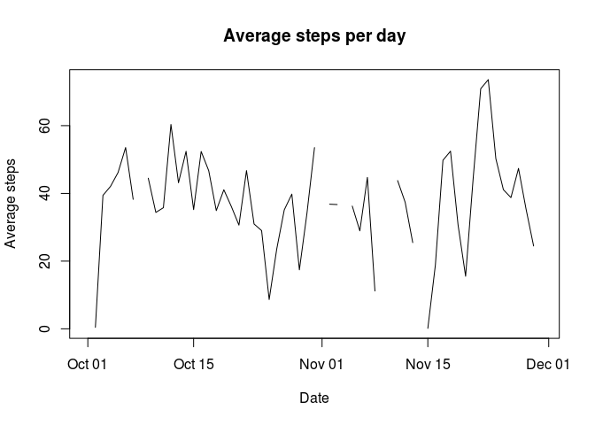
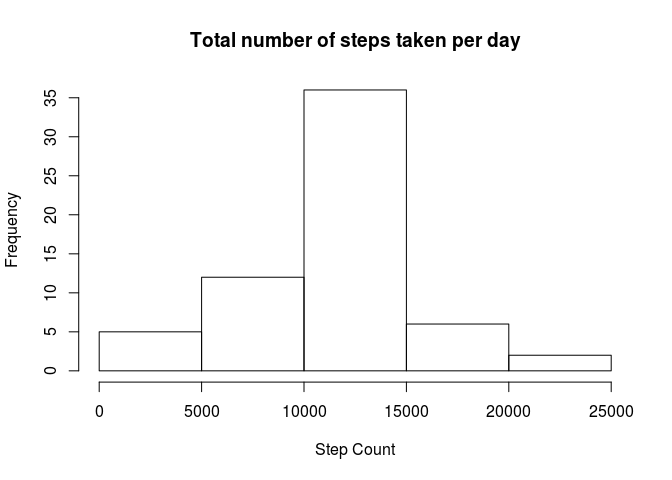
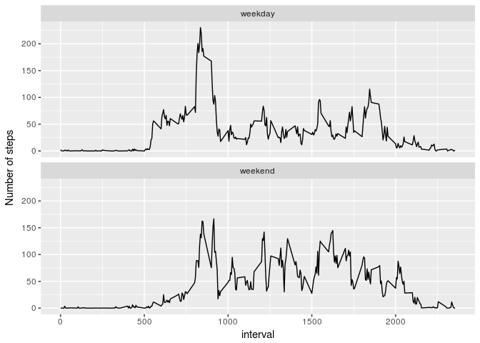

## Loading and preprocessing the data
First we load and summarise the data.


```r
library(dplyr)
```

```
## 
## Attaching package: 'dplyr'
```

```
## The following objects are masked from 'package:stats':
## 
##     filter, lag
```

```
## The following objects are masked from 'package:base':
## 
##     intersect, setdiff, setequal, union
```

```r
data.in <- read.csv("activity.csv")

data.in <- data.in %>% mutate(date = as.Date(date, "%Y-%m-%d"))

steps.summary   <- data.in %>% 
				           group_by(date) %>% 
				           summarise(steps.total = sum(steps),
				                     steps.average = mean(steps)
	                 )
```

## What is mean total number of steps taken per day?

```r
  hist(steps.summary$steps.total,
       main="Total number of steps taken per day",
       xlab="Step Count")
```

<!-- -->

```r
  steps.total.mean <- mean(steps.summary$steps.total, na.rm = TRUE)
  steps.total.median <- median(steps.summary$steps.total,  na.rm = TRUE)
```

The mean of daily steps is 1.0766189\times 10^{4} and the median of daily steps is 10765

## What is the average daily activity pattern?

The following is a graph of the average daily steps to let us form a picture of daily activity


```r
plot(x = steps.summary$date, 
     y = steps.summary$steps.average, 
     type="l",
     main = "Average steps per day",
     xlab = "Date",
     ylab = "Average steps"
     )
```

<!-- -->


```r
interval.summary <- data.in %>%
                    group_by(interval) %>%
                    summarise(steps.average = mean(steps, na.rm=TRUE))
      
interval.max <- interval.summary[interval.summary$steps.average == max(interval.summary$steps.average),"interval"]
```

The interval with the highest steps on average is 835

## Imputing missing values

The following explores the missing data in the data set


```r
total.na <- sum(is.na(data.in$steps))
```

Total Number of NAs in steps: 2304

To fill the missing values we will use a naive strategy of using the average steps for the given interval


```r
data.in.filled <- data.in

data.in.filled$steps <- ifelse(is.na(data.in$steps) == TRUE,
            			      interval.summary$steps.average[interval.summary$interval %in% data.in.filled$interval],
              			    data.in$steps)

steps.summary   <- data.in.filled  %>% 
				           group_by(date) %>% 
				           summarise(steps.total = sum(steps),
				                     steps.average = mean(steps)
	                 )

hist(steps.summary$steps.total,
       main="Total number of steps taken per day",
       xlab="Step Count")
```

<!-- -->

The above graph shows the missing values and appears to fill the gaps where the data were missing


```r
steps.total.mean.new <- mean(steps.summary$steps.total)
steps.total.median.new <- median(steps.summary$steps.total)
```

The new mean (after adding missing values)of daily steps is 1.0766189\times 10^{4} and the median of daily steps is 1.0766189\times 10^{4}

## Are there differences in activity patterns between weekdays and weekends?

Now to explorer the differences between activity during the weekdays and weekend days


```r
days.of.week <- c("Monday", "Tuesday", "Wednesday", "Thursday", "Friday")
data.in.filled$week.part <- ifelse(weekdays(data.in.filled$date) %in% days.of.week, "weekday", "weekend")
data.in.filled$week.part <- as.factor(data.in.filled$week.part)

interval.summary <- data.in.filled  %>%
                    group_by(interval, week.part) %>%
                    summarise(steps.average = mean(steps))

library(ggplot2)
plot <- ggplot(interval.summary, aes(interval, steps.average)) + facet_wrap( ~ week.part, ncol=1) + geom_line()
plot <- plot + ylab("Number of steps")
plot
```

<!-- -->
